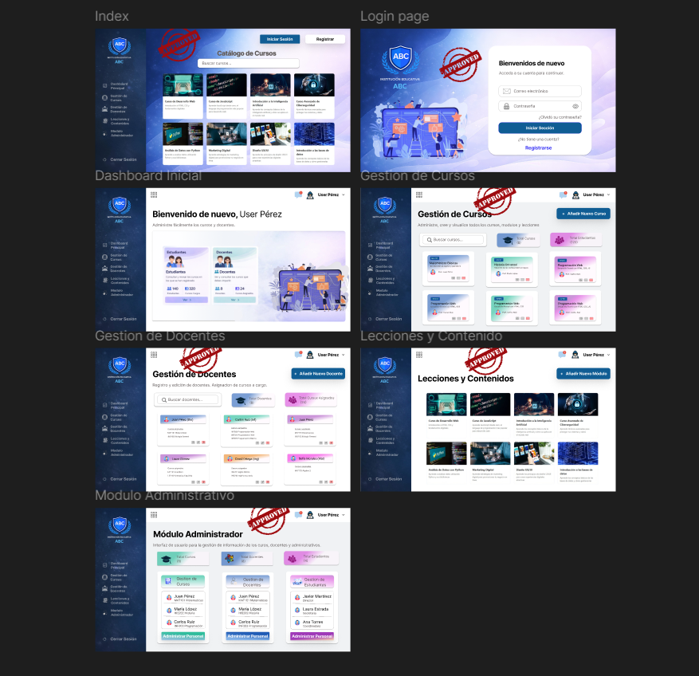

# 🎓 Instituto ABC — Plataforma de Gestión Académica

Sistema web para la gestión de cursos, docentes y administración académica del *Instituto ABC*.  
El proyecto permite visualizar cursos, administrar docentes, gestionar información institucional y manejar autenticación básica para el acceso al módulo administrativo.

Diseñado como una plataforma ligera basada en HTML, CSS y JavaScript, utilizando JSON como fuente de datos y SessionStorage para la gestión de sesión.

---
##     📁 Estructura del proyecto

```
    Proyecto_JavaScript_ABC/
    │
    ├── index.html
    │
    ├── css
    │   └── styles.css
    │
    ├── images
    │   └── recursos gráficos del sistema
    │
    ├── js
    │   ├── auth.js
    │   ├── cursos.js
    │   ├── dashboard.js
    │   ├── gestionDocentes.js
    │   ├── header.js
    │   ├── loginPage.js
    │   ├── modal.js
    │   └── modules.js
    │
    ├── json
    │   ├── info-admin.json
    │   ├── modules.json
    │   └── profesores.json
    │
    └── pages
        ├── catalogo-cursos.html
        ├── gestion-cursos.html
        ├── gestion-docentes.html
        ├── login.html
        └── modulo-admin.html
```
---
## ⚙️ Tecnologías utilizadas

### 💻 Frontend
- HTML5
- CSS3
- JavaScript (Vanilla JS)

### 📦 Manejo de Datos
- JSON

### 🔐 Gestión de Sesión
- localStorage
- sessionStorage

### 🎨 Diseño UI
- Figma
---
 ## 🔐 Sistema de Autenticación

El sistema incluye un login administrativo que valida credenciales desde un archivo JSON.

Cuando el login es exitoso:
```
    sessionStorage.setItem("isLoggedIn", "true")
```

Esto permite controlar el acceso a los módulos administrativos.
Si un usuario intenta acceder sin sesión activa, es redirigido automáticamente al login.
---
## 🧩 Funcionalidades Clave
### 📚 Catálogo de Cursos
- Visualización en tarjetas dinámicas
- Descripción del curso
- Lecciones
- Contenido multimedia

### 👨‍🏫 Gestión de Docentes

Permite visualizar y administrar información de docentes:
- Nombre
- Especialidad
- Edad
- Género
- Contacto

Los datos se cargan dinámicamente desde:
```
    json/profesores.json
```
### 🧠 Módulo Administrador

Panel administrativo para gestionar:
- Cursos
- Docentes
- Información institucional

Acceso restringido mediante login.
---
## 🚀 Cómo Ejecutar el Proyecto

1️⃣ Clonar el repositorio

```
    git clone https://github.com/Dana-villa/Proyecto_JavaScript_ABC.git
```

2️⃣ Abrir el proyecto en Visual Studio Code

3️⃣ Ejecutar con Live Server o cualquier servidor local

Ejemplo:
```
    http://127.0.0.1:5500
```
---
## 📁 Manejo de Datos
Los datos del sistema se almacenan en archivos JSON:
| Archivo           | Descripción                    |
| ----------------- | ------------------------------ |
| `info-admin.json` | Credenciales del administrador |
| `modules.json`    | Contenido de módulos           |
| `profesores.json` | Información de docentes        |
---
🎨 Diseño del Sistema

El diseño visual fue desarrollado en [Figma](https://www.figma.com/design/uesaKBL5j62psodvfbkVHQ/ABC?node-id=0-1&t=kX7929M2cndCzUv9-0).



---
## 👨‍💻 Autores
### 🎨 [Dana Villamizar](https://github.com/Dana-villa)
Responsable del diseño visual, prototipado en Figma y experiencia de usuario.
### 🤖 [Karina Méndez](https://github.com/sixthdam)
Encargado de la lógica de interacción, manejo de datos JSON y funcionalidades del sistema.
### 🎰[Santiago Domínguez](https://github.com/Shiroses)
Encargado del desarrollo de funcionalidades dinámicas, manejo de sesión y estructura del sistema.

